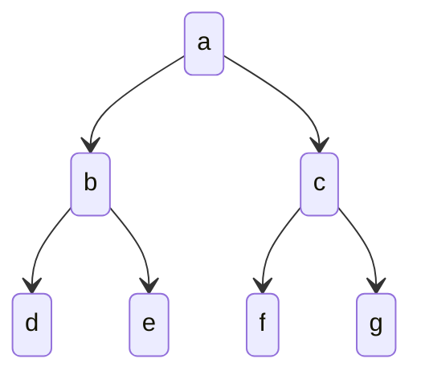
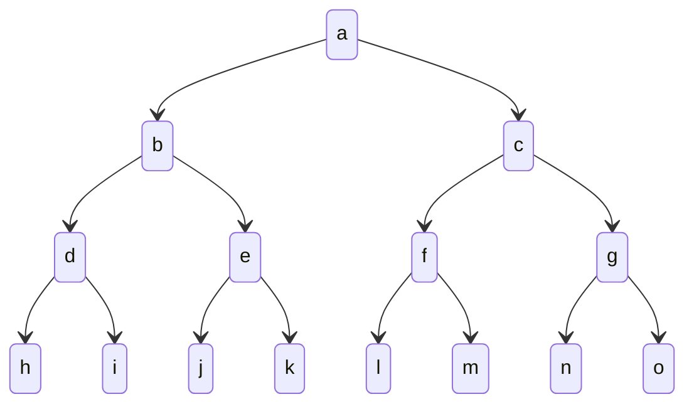

#lecture
# uninformed search
class: [[CM12001A]]
topics mentioned: #ai #search
date: 2024-11-11
teacher: [[Ben Ralph]]
## rational agents
an [[agent]] is simply something which **acts**. a *rational* [[agent]] is something which acts *rationally*. acting *rationally* means that an [[agent]] will act in a way to achieve the **best outcome**, or if there is some uncertainty, the best *expected* outcome.
## search problems
a search problem is a situation where an agent chooses a series of *actions* to take it from **an *initial state* to a specified *goal state***.

## graphs
[[graph]]s are defined by a collection of *vertices* (points) connected to each other by *edges* (lines). edges can either be *weighted* (has a cost) or *unweighted*. edges can also be *directed* or *undirected*.
### trees
a [[tree]] is a special type of [[graph]], with additional rules that every node (except the *root* [[node]]) has exactly one parent [[node]]. additionally, no node can be its own ancestor, preventing cycles. finally, each node and all of its descendants form a *subtree*.
## representing search problems 
to represent search problems, we can use a *[[state space]]*. this is an abstraction of the search problem, where any extraneous information is removed, leaving only states and actions to move between them. the state space consists of a set of *states*, including the *initial state* and the *goal state*, as well as a set of *actions* that can be taken from each state.
## representing searches
while we use a [[state space]] to represent the problem, we use a [[tree]] to represent the carrying out of the search of the state space, called the [[search tree]]. in the search tree, the children of each node are the states reachable in a single action.
## breadth-first search 
in a *[[breadth-first search]]*, we explore the **shallowest state in the frontier**.

for example, for this tree, if `a` has been searched, the next shallowest nodes are `b`/`c`. one of these will then be searched, then the other, and then finally, `d,e,f,g` are searched.
## depth-first search
in a *[[depth-first search]]*, we explore the **deepest state in the frontier**.

for example, for this tree, if we start at node `a`, we would search `b`, then `d`, then `h`, then `i`, and so on, exploring as far as possible along each branch before *backtracking*. this contrasts with [[breadth-first search]], where we would explore all nodes at a given depth before moving on to the next level.