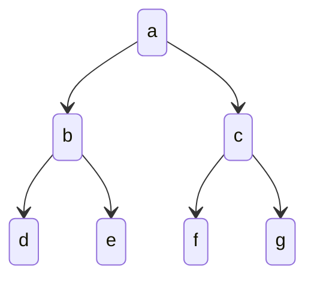

#search 
in a *[[breadth-first search]]*, we explore the **shallowest state in the frontier**.

for example, for this tree, if `a` has been searched, the next shallowest nodes are `b`/`c`. one of these will then be searched, then the other, and then finally, `d,e,f,g` are searched.