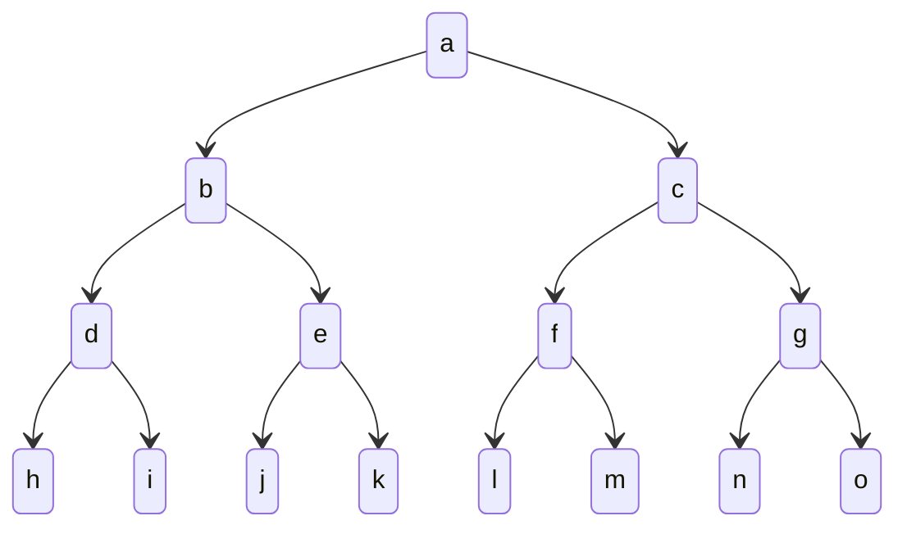

#search
in a *[[depth-first search]]*, we explore the **deepest state in the frontier**.

for example, for this tree, if we start at node `a`, we would search `b`, then `d`, then `h`, then `i`, and so on, exploring as far as possible along each branch before *backtracking*. this contrasts with [[breadth-first search]], where we would explore all nodes at a given depth before moving on to the next level.