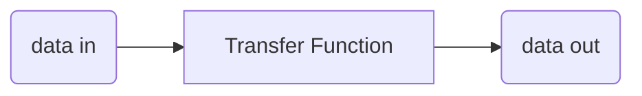

#lecture 
# history
class: [[CM12002]]
topics mentioned: #history #intro 
date: 2024-09-30
teacher: [[Fabio Nemetz]]
lecture notes: [[CM10194 - Lecture Notes 01.pdf#page=1]] [[CM12002_W01_L01_P01_Brief_History.pdf]] [[CM12002_W01_L01_P02_Brief_History.pdf]]

## what is a modern computer?
the first machine that can be considered a *modern* computer is Charles Babbage's Analytical Engine, which could be described as [[turing machine|turing-complete]], that is it can assume the role of a [[turing machine]].

computers are sometimes called *electronic brains*, or more commonly, *number crunchers*. we can think of them as **data processors**.

while we normally consider computers to be a black box as a programmer, where we do not care about it's internals, here we will think about a computer as a device that has an *internal structure*.

> [!QUESTION] why do this?
> learning about the internal structure is useful as:
> + having a mental model of a computers internals is useful when solving problems
> + allows you to build more efficient and optimized programs
> + you can avoid errors, and recover from them, more easily

