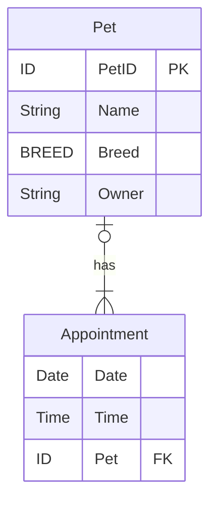

#lecture
# 19 - introduction to relational databases
class: [[CM12004]]
topics mentioned: #databases
date: 2024-11-18
teacher: [[Andy Barnes]]
## what are databases?
> a [[database]] is a centre of operations for a collection of discrete or continuous values that convey information.

## relational model
in a [[relational model]], [[relation]]s are physically represented by tables of data. each [[relation]] represents an [[entity]] in the real world.
+ each cell contains one *atomic* value.
+ each column represents an *attribute* of the entity.
+ each tuple (row) is *distinct*.
+ the ordering of the tuples is irrelevant.
+ the values in each column come from the same *domain*.
+ every tuple in a relation can be uniquely identified, as they're all unique. 
+ there is a minimum set of attributes that will identify a tuple. this is called the [[primary key]].
+ relations may also have attributes which are the [[primary key]] of another relation. we call this a [[foreign key]].
## entity relationship diagrams ([[ERD]]s)
to show our relationships between relations, we create diagrams called *conceptual entity relationship diagrams ([[ERD]]s)*.
for example, for the relations:
> Appointment(**Date**,**Time**,Pet*)
> Pet(**PetID**,Name,Breed,Owner)

 we can draw the following diagram:
 ```mermaid
 erDiagram
	 Pet|o--|{Appointment: has
```
we can also add our attributes to the model:
