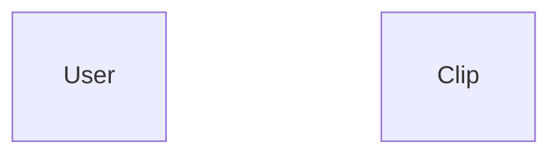
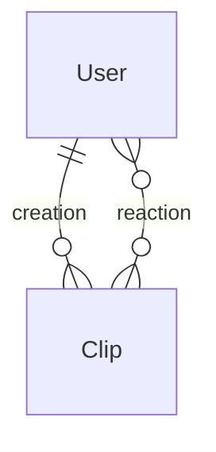
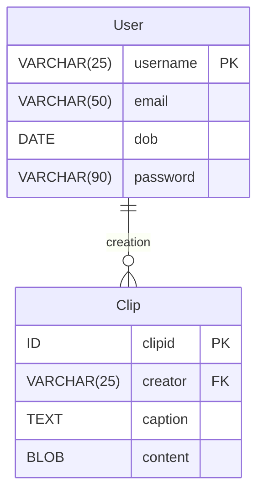
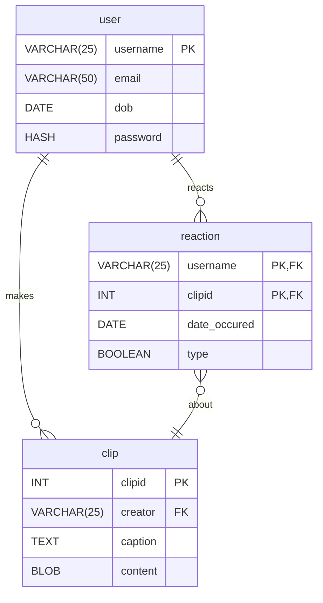

#lecture

# 20 - logical database design

class: [[CM12004]]
topics mentioned: #databases #sql #erds
date: 2024-11-20
teacher: [[Andy Barnes]]

## attributes

in [[relational database]]s we have a variety of attribute [[type]]s. these function like datatypes in programming. each attribute has a respective type.

> [!EXAMPLE] example
> some common examples of types include:
>
> - `FLOAT`
> - `INT`/`INTEGER`
> - `VARCHAR(X)`
> - `CHAR(X)`
> - `DATETIME`
> - `BOOLEAN`
> - `TEXT`
> - `BLOB`

### scenario

consider a application where users can upload clips and also react to clips.
if we wanted to describe the two entities in this example, we could draw a diagram:

now we can consider the relationships our two entities have:

next, we can populate the entities attributes:

## many-to-many relationships

many-to-many relationships between two entities _cannot_ be represented by the two entities alone. instead, a **[[linking table]]** is used:

here, our table has a _[[compound key]]_, composed from the `clipid` [[foreign key]] and the `username` foreign key.
