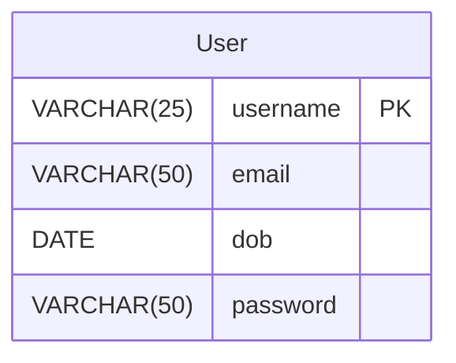
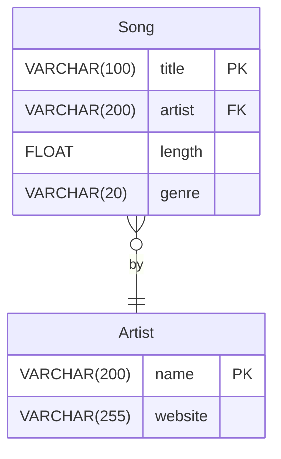
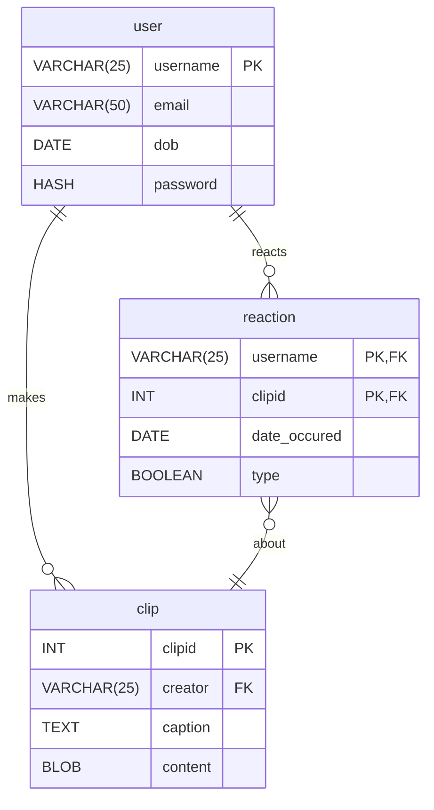

#lecture

# 21 - building relational databases

class: [[CM12004]]
topics mentioned: #relations #sql #erds 
date: 2024-11-22
teacher: [[Andy Barnes]]

## structured query language

there are four subtypes of language included in [[SQL]]:

- **data definition language**: building [[database]] structure
- **data control language**: defining user access control
- **data manipulation language**: changing data in the DB
- **data query language**: extracting data from the DB

## creating databases
to create an empty database:
```sql
CREATE DATABASE reaction_storage;
```

## creating tables
to create a table, such as:



we use the following [[SQL]]:

```sql
CREATE TABLE user(
  username VARCHAR(25),
  dob DATE,
  password VARCHAR(90),
  PRIMARY KEY(username)
);
```

if we have a more complex set of entities, such as:



we can write the following [[SQL]]:

```sql
CREATE TABLE Artist (
  name VARCHAR(200),
  website VARCHAR (255),
  PRIMARY KEY (name)
);

CREATE TABLE Song (
  title VARCHAR(100),
  artist VARCHAR(200),
  length FLOAT,
  genre VARCHAR(20),
  FOREIGN KEY (artist) REFERENCES artist ON Artist(name),
  CHECK (length > 0)
);
```

^5da819

## constraints
we can also use _constraints_ on our fields to specify the optionality of our relations.
for example, we can use `NOT NULL` on a field to specify a mandatory field.
additionally, we can add `CHECK`s, which are run every time a new record is added to a table.
for example, in [[21 - building relational databases#^5da819|the previous SQL example]], we used `CHECK(length>0)`.

## modifying tables 
we can change the structure of tables with `ALTER`:
```sql
ALTER TABLE username
ADD COLUMN pnum CHAR(11);

ALTER TABLE user
DROP COLUMN phone;

DROP TABLE user;
```
# cascading operations
allowing CRUD operations on relational databases, especially delete operations has one issue, *consistency*.

what happens when a `user` wants to delete their account? do we delete all their content? 
the answer is through a *cascading delete*. deletes follow [[foreign key]]s. this means that all a users reactions and clips would be deleted. we can also use a *cascading SET NULL*, where all the user's [[foreign key]]s would be set to NULL